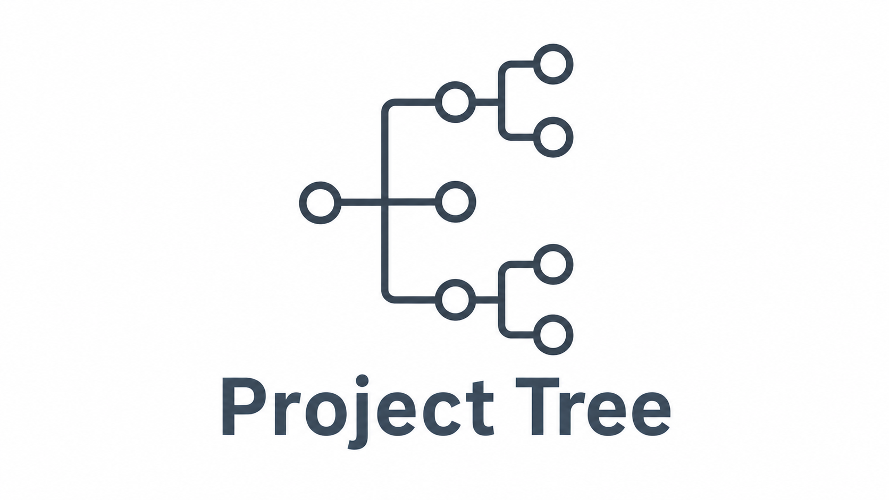

# Project Tree




Project Tree is a small, deterministic utility that generates a Markdown representation of a project’s directory structure. It produces stable, predictable output and optionally watches the filesystem for structural changes. The installed command is `projtree`.

---

## Features

* Generates a **deterministic Markdown project tree**
* Uses a **simple, explicit ignore system** based on exact name matching
* Optional **watch mode** for continuous regeneration
* **Minimal, testable, and robust design**

---

## Installation

> [!NOTE]
> Due to Python packaging restrictions, installation should be performed inside a virtual environment or via a system-level package manager that supports global installs.

### A. **UV** (Easiest & Recommended)

If you already have `UV` installed, simply run:

```bash
uv pip install "git+https://github.com/Nuxview/Project-Tree.git"
```

If you need a specific version, run:

```bash
uv pip install "git+https://github.com/Nuxview/Project-Tree.git@vX.Y.Z"
# Replace vX.Y.Z at the end with the version you want
```

### B. Repo Clone (Mostly For Contributors)

If you want to view the source code or make your own changes to it:

#### 1. Clone the repository

```bash
git clone https://github.com/Nuxview/Project-Tree.git
```

#### 2. Install the package

##### **Option A: Standard install**

```bash
pip install /path/to/repo/clone
```

This installs `projtree` as a normal package.

##### **Option B: Editable install (recommended for development)**

```bash
pip install -e /path/to/repo/clone
```

This installs `projtree` in **editable mode**, so changes to its code are reflected immediately.

> [!NOTE]
> `Watchdog` is a required runtime dependency and is installed automatically.

#### 3. Optional development dependencies

To run the test suite with `pytest`:

```bash
pip install ".[dev]"
```

This installs `pytest`, which is **only required for running tests** and is not needed for normal usage.

### C. Nix Flake

If you use Nix:

- **Project Tree development (editable install):**

  ```bash
  nix develop github:Nuxview/Project-Tree
  ```

  This provides Python, `uv`, and `git`, and installs `projtree` in editable mode.

- **CLI usage in other repositories (non-editable):**

  ```bash
  nix develop github:Nuxview/Project-Tree#cli
  ```

  This provides the `projtree` CLI as a regular package without editable install.

#### Use the flake from an existing flake.nix

Add Project Tree as an input and reuse either output:

```nix
{
  inputs.project-tree.url = "github:Nuxview/Project-Tree";

  outputs = { self, nixpkgs, project-tree }:
    let
      system = "x86_64-linux";
    in {
      # Editable Project Tree development shell
      devShells.${system}.project-tree-dev = project-tree.devShells.${system}.default;

      # Regular CLI usage shell (no editable install)
      devShells.${system}.project-tree-cli = project-tree.devShells.${system}.cli;
    };
}
```

---

## Getting Started

1. Install the package using the steps above.
2. Run `projtree` from your project root to generate `structure.md`.

```bash
projtree
```

## Usage

See the [usage documentation](docs/usage.md) for the full command reference, options, and example output.

---

## Ignore System

* Built-in defaults include common directory and file names (e.g. `.git`, `__pycache__`, `node_modules`)
* A `.projtreeignore` file in the project root is supported
* For normal runs, CLI `--ignore` arguments are merged with project and built-in ignores
* In `--watch` mode, CLI `--ignore` values are also forwarded, so watching uses built-in defaults, `.projtreeignore`, and any CLI-supplied ignores
* Ignore rules match **exact names anywhere in the tree** (e.g., `src` ignores any file/dir named `src` at any depth)
* No globbing, wildcards, or pattern-based matching in v1
* If the output file is under the project root, its file name is also added to the ignore set to prevent regeneration loops

Example `.projtreeignore`:

```text
.venv
__pycache__
build
dist
```

---

## Running Tests

If you installed development dependencies:

```bash
pytest
```

All generator tests assert against **full output** to enforce deterministic structure.
Watcher tests are intentionally minimal and validate regeneration behavior only.

---

## License

This project is licensed under the MIT License. See [LICENSE](LICENSE) for details.

---
